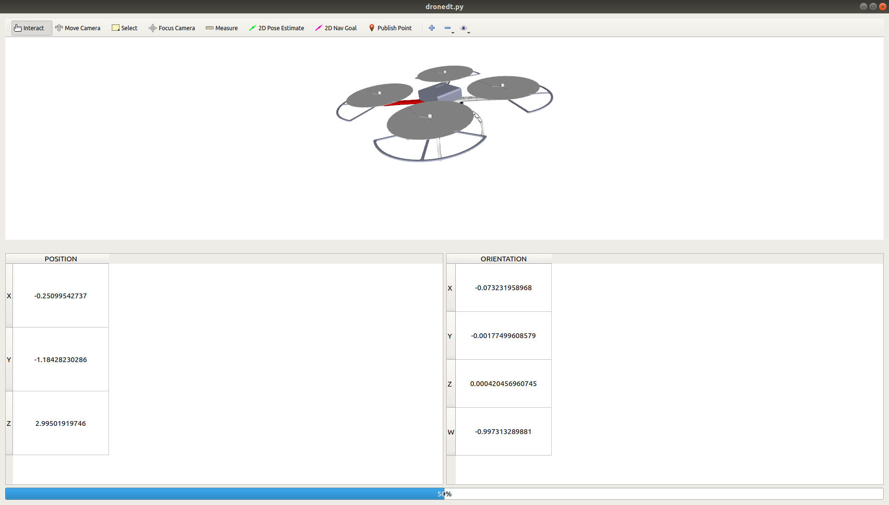

# DroneDT!

## Mobile Control
- cd ~/PX4-Autopilot/ && make px4_sitl gazebo_custom_f450
- roslaunch mavros px4.launch fcu_url:="udp://:14540@192.168.0.4:14557"
- rosrun mavros_mobile_control control.py

## Drone Digital Twin Display
- roslaunch f450 display.launch
- roslaunch learning_tf launch3.launch
- ./dronedt.py

